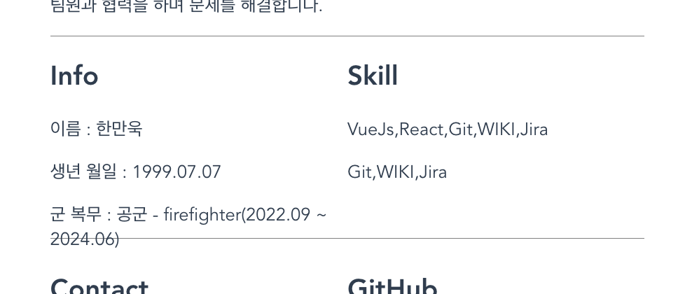
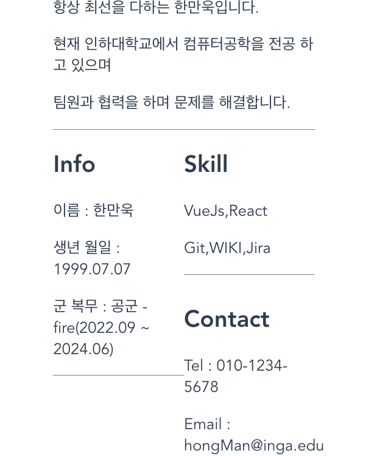
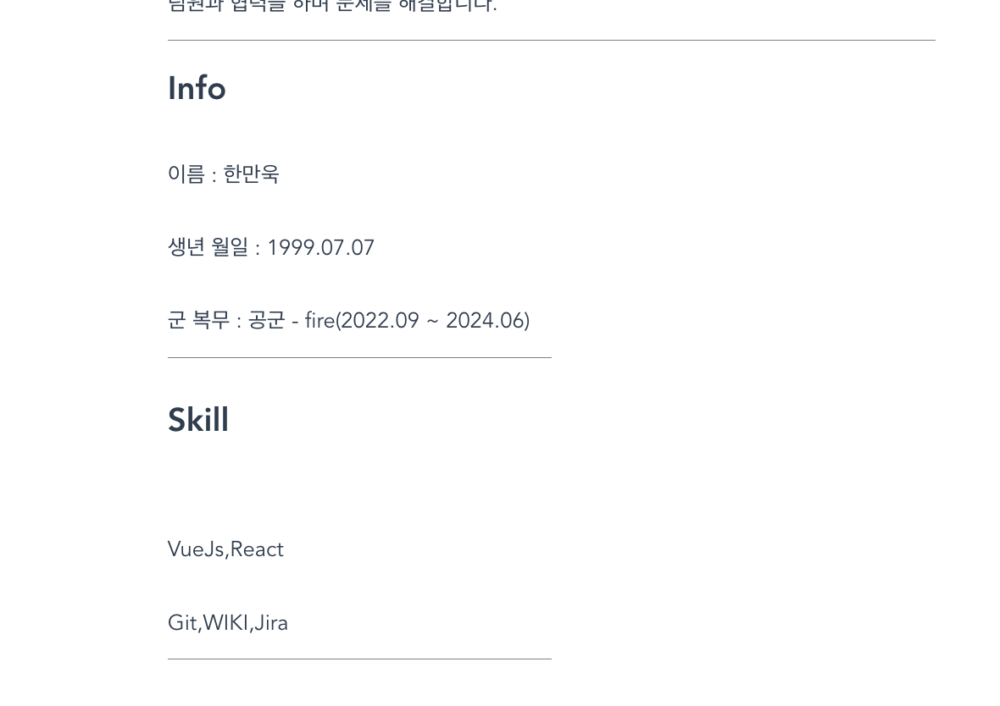
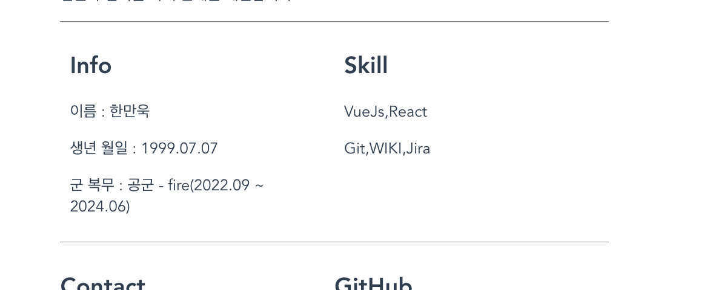

# Portfolio

Vue.js를 사용한 개인 포트폴리오 웹사이트입니다.

## Project setup

```
npm install
```

```
npm run serve
```

### 브라우저에서 접근

```
http://localhost:8080
```

## 프로젝트 설계

### 1. 반응형 레이아웃 설계

- **Flexbox 활용**: 고정값을 최소화하여 다양한 화면 크기에 대응
- **문제점 발견**: 초기 고정값 사용 시 긴 텍스트가 잘리는 현상 발생
- **해결 방안**: Flexbox의 유연한 크기 조정을 통해 컨텐츠에 맞는 동적 크기 조정
- **목표**: 데스크톱부터 모바일 뷰까지 원활한 사용자 경험 제공

### 2. 마스킹 기능 최적화

- **초기 계획**: hover 시 parse를 통한 실시간 마스킹 처리
- **성능 문제**: 매번 hover 이벤트마다 parse 연산 발생
- **최적화 방안**: 사전에 마스킹된 문자열을 데이터로 저장
- **결과**: hover 시 단순 문자열 교체로 성능 향상

### 3. 컴포넌트 구조

```
src/
├── components/
│   ├── ContactMe.vue     # 개인정보 및 스킬
│   └── FamilyInfo.vue    # 가족정보 (마스킹 기능)
└── App.vue               # 메인 컴포넌트
```

### 4. 문제해결과정

1. css 깨짐문제
   
   해당 사진처럼 border-bottom에 의해 글씨가 깨진는 현상 발생
   원인 : 부모요소의 height가 180px로 고정이 되어있어서 자식요소가 넘치는 경우가 발생했음
   해결 : 1.부모요소의 고정값 제거
   
   -> 해당 사진처럼 같은 라인의 태그가 height 값이 달라져버림
   해결 : 2.div태그에 flex 적용
   
   -> 모든 div 태그가 적용이 되어서 문제발생
   해결 : 3.container div태그 방법
   -> 모든 div를 감싸는 container 태그를 만들고 해당 태그를 통해 felxbox 제어
   

   -> width가 줄어듦에 따라 height가 늘어나고 줄어들도록 구현했습니다

2. hover 마스킹 문제  
   마스킹마다 매번 연산이 일어나는 parse 방식과 인라인 데이터를 저장해 놓는 방식 둘 중 고민했습니다.  
   최종적으로는 **인라인 데이터를 사전 저장**하는 방식으로 결정했습니다.

- 이유: hover 이벤트는 사용자가 자주 발생시키는 인터랙션이기 때문에, 매번 연산(parse)을 수행하면 성능 저하가 발생할 수 있습니다.
- 개선 방안: 초기 렌더링 시 문자열을 미리 데이터로 저장하고, hover 시 단순히 마스킹 문자열과 원본 문자열을 토글하는 방식으로 처리했습니다.
- 결과: 사용자 경험이 매끄러워지고, hover 시 자연스럽게 동작하도록 최적화되었습니다.

## 주요 기능

- 반응형 웹 디자인
- 주민등록번호 마스킹/언마스킹 (hover 기능)

### React 개발자의 시점에서 본 Vue

이번 프로젝트는 React에 익숙한 저에게 Vue.js를 학습하고 활용해본 경험이었습니다.
React와 Vue는 둘 다 컴포넌트 기반의 UI 라이브러리/프레임워크라는 공통점이 있지만, 세부적인 개발 경험과 철학에서는 여러 차이점이 존재했습니다.

1. 템플릿 문법 vs JSX

Vue는 기본적으로 template 태그 안에서 HTML과 유사한 문법으로 UI를 선언합니다. React는 JSX를 사용하여 JavaScript 안에 HTML을 작성하는 형태입니다.
• Vue의 template 문법은 직관적이고 구조가 명확하여 빠르게 레이아웃을 구성할 수 있었습니다.
• 반면 React에서 사용하던 고차 함수(map, filter 등)와 JS 변수를 자유롭게 활용하는 익숙한 방식(JSX)에 비해 Vue template는 약간의 제약(v-for, v-if 등)이 느껴졌습니다.

2. 상태 관리

Vue에서는 data 속성으로 컴포넌트의 상태를 정의하고, computed와 watch를 통해 반응형 처리를 합니다.
• React의 useState, useEffect와 비교하면 Vue의 computed는 선언적이고 명확하게 파생 데이터를 관리할 수 있어 편리했습니다.
• 반면 React의 Hook은 좀 더 로직 재사용과 추상화가 유연하게 이루어질 수 있어서 상황에 따라 장단이 있습니다.

3. 이벤트 처리

Vue에서는 v-on:click 혹은 @click과 같이 이벤트 바인딩이 HTML적인 감각으로 이루어집니다.
• React에서는 JSX 문법 안에서 { () => ... } 형태로 JS 코드가 직접 들어가므로 더 함수형 프로그래밍에 가깝게 구성하는 것이 자연스러웠습니다.
• Vue는 상대적으로 마크업과 로직의 분리가 명확한 느낌이 있습니다.

4. 컴포넌트 구조와 스타일

Vue는 .vue 파일 하나에 template, script, style이 한 곳에 모여 있습니다.
• React는 일반적으로 JS/TSX 파일과 CSS 파일을 별도로 관리하거나 CSS-in-JS를 사용합니다.
• Vue는 초반에는 구조 파악이 쉽고, React는 대규모 프로젝트에서 스타일 관리와 컴포넌트 확장이 유리하다고 느껴졌습니다.

5. 학습 난이도

Vue는 진입장벽이 낮고 문서화가 잘 되어 있어 React 개발자가 빠르게 적응할 수 있었습니다.
• 특히 Vue의 옵션 API는 React 초보자보다 더 HTML 친화적인 개발자에게 매력적이라고 생각이들었습니다.

총평

Vue.js는 React에 비해 더 선언적이고 명시적인 구조를 제공하여 빠른 프로토타이핑과 소규모 프로젝트에 적합한 느낌을 받았습니다.

이번 Vue 기반 포트폴리오 프로젝트를 통해 React와 Vue의 차이점과 각자의 장점을 체험할 수 있었고, 추후 프로젝트 요구사항에 따라 적절한 프레임워크 선택에 도움이 되는 좋은 학습 경험이 되었습니다.

## 기술 스택

- Vue.js 2
- CSS3 (Flexbox)
- HTML5
